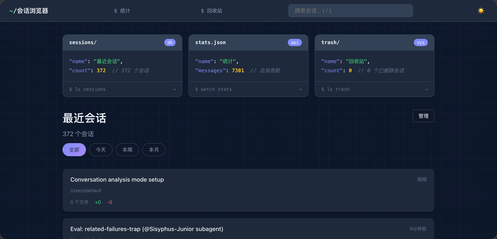
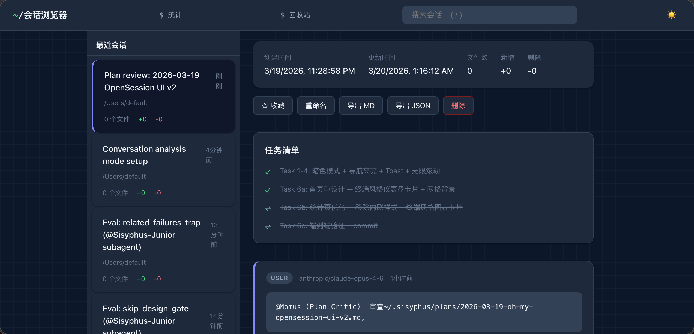
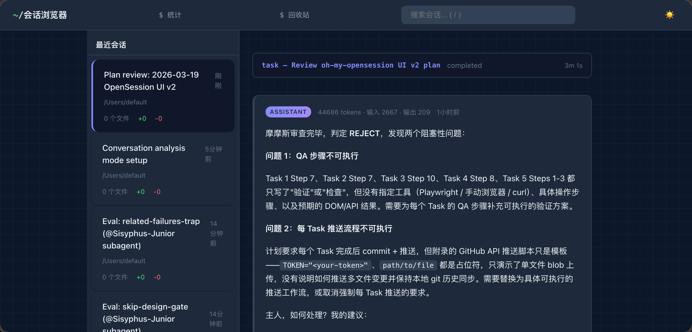
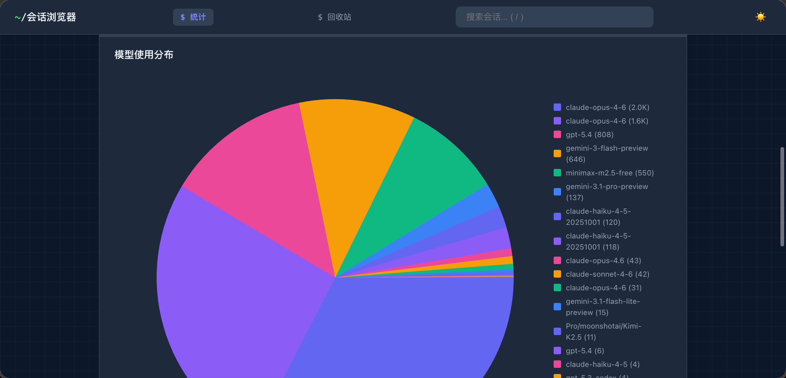
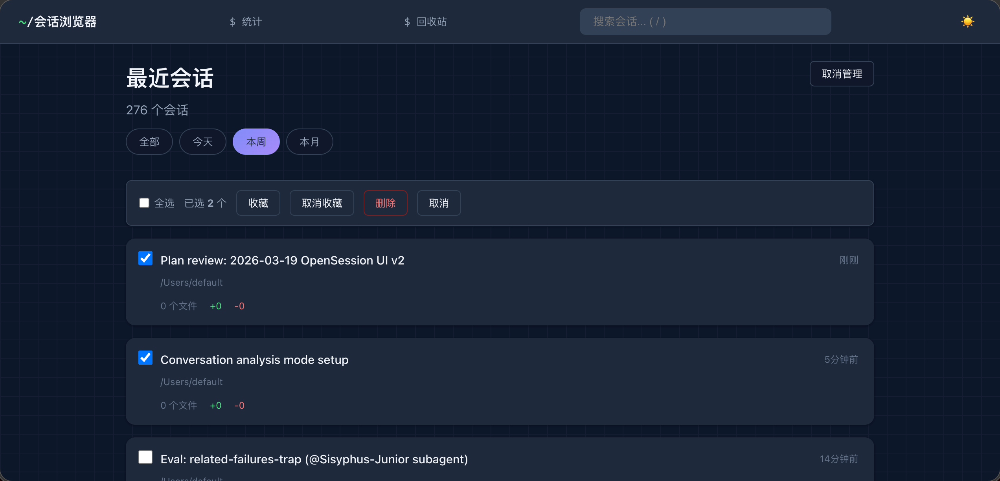

<p align="center">
  
</p>

<h1 align="center">✨ oh-my-opensession ✨</h1>

<p align="center">
  <strong>🖥️ Your AI pair-programming "memoir" — a terminal-styled <a href="https://opencode.ai">OpenCode</a> session browser</strong>
</p>

<p align="center">
  <a href="./README.en.md">English</a> · <a href="./README.md">中文</a>
</p>

<p align="center">
  
  
  
  
</p>

<p align="center">
  <em>Every conversation with AI deserves to be remembered 📖</em><br/>
  <em>Like scrolling through old chats with a friend — except this one writes code 🤖</em>
</p>

---

## 🤔 What is this?

Ever caught yourself thinking—

> "How did I get Claude to fix that bug last week?"
> "That regex AI wrote was *chef's kiss* — where did it go?"
> "How many tokens have I burned through? 💸"

**oh-my-opensession** is here to help. It's a local web app that lets you browse, search, and manage all your OpenCode sessions — with dark mode, terminal aesthetics, and a sprinkle of geek romance 🌙

---

## 🎬 Preview

<details open>
<summary><strong>🏠 Dashboard — terminal vibes, developer romance</strong></summary>
<br/>
<p align="center">
  
</p>
</details>

<details>
<summary><strong>💬 Session Detail — every late-night chat with AI</strong></summary>
<br/>
<p align="center">
  
</p>
<p align="center">
  
</p>
</details>

<details>
<summary><strong>📊 Token Stats — how's your wallet doing?</strong></summary>
<br/>
<p align="center">
  
</p>
</details>

<details>
<summary><strong>🗂️ Batch Management — Marie Kondo your sessions</strong></summary>
<br/>
<p align="center">
  
</p>
</details>

---

## 🚀 3-Second Launch

```bash
npx oh-my-opensession
```

> 💡 Open `http://localhost:3456` and start archaeologizing your AI coding journey!

Want it permanent?

```bash
npm install -g oh-my-opensession
oh-my-opensession --open  # auto-opens browser, for the lazy among us
```

---

## ✨ What can it do?

| | Feature | TL;DR |
|:---:|:---|:---|
| 🌙 | **Dark Mode** | Auto-follows system preference. Late-night coding without the eye burn |
| 🖥️ | **Terminal Aesthetic** | Code-block cards + grid background. Makes you *want* to code |
| 🔍 | **Search & Filter** | By keyword, time range. No more needle-in-a-haystack |
| ♾️ | **Infinite Scroll** | Silky smooth loading. No more page-clicking carpal tunnel |
| ⭐ | **Star** | Bookmark the good stuff. Find it in one second next time |
| ✏️ | **Rename** | "untitled-session-47"? Not on our watch |
| 🗑️ | **Soft Delete** | Fat-fingered a delete? Trash has your back |
| 📤 | **Export** | Markdown / JSON one-click export. Blog material: acquired |
| 📊 | **Token Stats** | Usage trends, model distribution. See where the money went |
| 🔔 | **Toast Notifications** | Every action gets feedback. No more staring at the screen |
| 🗂️ | **Batch Operations** | Multi-select star/delete. Efficiency: maxed out |
| 🌐 | **Bilingual** | `--lang en` for English, `--lang zh` for Chinese |
| 🔒 | **Read-Only Safe** | Never touches your OpenCode DB. Pinky promise |
| 📦 | **Zero Dependencies** | Just Node.js. No node_modules black hole |

---

## 🛠️ Requirements

- **Node.js** >= 22.5.0 (uses built-in `node:sqlite`, hence the version bump)
- [OpenCode](https://opencode.ai) installed with session data (runs without data too, just... empty 😅)

| Platform | Architecture | Status |
|:---|:---|:---:|
| 🍎 macOS | x64 / Apple Silicon (arm64) | ✅ |
| 🪟 Windows | x64 / arm64 | ✅ |
| 🐧 Linux | x64 / arm64 | ✅ |

> Pure JS, zero native dependencies — if Node.js runs, we run 🏃

## ⚙️ CLI Options

```
Option                  Description                   Default
--port <number>         Server port                    3456
--db <path>            Path to opencode.db             Auto-detect
--lang <en|zh>         UI language                     Auto-detect
--open                 Open browser on start           false
-h, --help             Show help                       —
```

## 🔧 Environment Variables

| Variable | Description |
|:---|:---|
| `PORT` | Server port (`--port` takes priority) |
| `SESSION_VIEWER_DB_PATH` | Path to opencode.db (`--db` takes priority) |
| `OH_MY_OPENSESSION_META_PATH` | Metadata DB path |

---

## 🧠 How It Works

```
┌─────────────────────────────────────────┐
│  OpenCode DB (read-only)                │
│  └── session / message / part / todo    │
└──────────────┬──────────────────────────┘
               │ SELECT (never INSERT/UPDATE)
               ▼
┌─────────────────────────────────────────┐
│  oh-my-opensession                      │
│  ├── Server-side rendered HTML          │
│  ├── Infinite scroll API                │
│  └── Management ops → meta.db (separate)│
└──────────────┬──────────────────────────┘
               │ http://localhost:3456
               ▼
┌─────────────────────────────────────────┐
│  🌙 Your Browser                        │
│  └── Dark mode / Terminal UI / Toasts   │
└─────────────────────────────────────────┘
```

Your OpenCode data is **absolutely safe** — we look but don't touch. Stars, renames, and deletes live in a separate `meta.db`:

```
macOS:   ~/.config/oh-my-opensession/meta.db
Windows: %APPDATA%\oh-my-opensession\meta.db
```

---

## 💖 Donate

If this project made you smile, consider buying me a Mixue ice cream 🍦

<p align="center">
  
  &nbsp;&nbsp;&nbsp;&nbsp;
  
</p>
<p align="center">
  <sub>WeChat Pay &nbsp;&nbsp;&nbsp;&nbsp;&nbsp;&nbsp;&nbsp;&nbsp;&nbsp;&nbsp;&nbsp;&nbsp;&nbsp;&nbsp;&nbsp;&nbsp;&nbsp;&nbsp;&nbsp;&nbsp;&nbsp;&nbsp;&nbsp;&nbsp;&nbsp;&nbsp;&nbsp;&nbsp;&nbsp;&nbsp;&nbsp;&nbsp;&nbsp;&nbsp;&nbsp;&nbsp; Alipay</sub>
</p>

---

## 📄 License

MIT — use it, have fun 🎉
